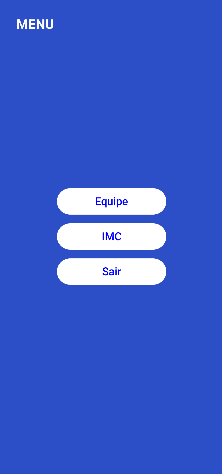
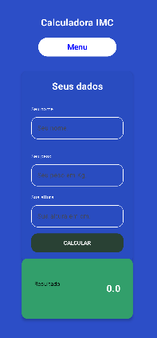
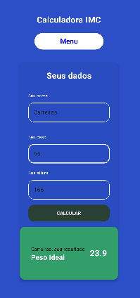

# fiap-3sis-android-kotlin-gs2

1. [Sobre](#sobre)
2. [Estrutura](#estrutura)

## Sobre

O projeto feito para a entrega da Global Solutions é uma aplicação Android criada para calcular o IMC do usuário com base no seu peso e altura.

A página inicial da aplicação apresenta uma tela de login, na qual o usuário digita seu nome de usuario e senha.

Ao pressionar o botão "Logar", caso as credenciais estejam corretas, o aplicativo redireciona para a tela de Menu, na qual o usuário pode escolher ir para a tela de cálculo do IMC, acessar a tela de equipe ou sair.

Escolhendo a tela de cálculo do IMC, um formulário é apresentado no qual devem ser informados os campos de nome da pessoa, peso e altura. 

Após informá-los, basta pressionar o botão "Calcular" que o resultado do calculo de IMC será exibido logo abaixo em um Card.

Na tela de equipe, apenas os dados da autora da aplicação são exibidos.

Para cada tela, o usuário tem a opção de retornar ao menu no fim da página.

## Estrutura

O projeto foi construído com o Android 35 com JetPackCompose, utilizando o Gradle como compilador e o Java 11.